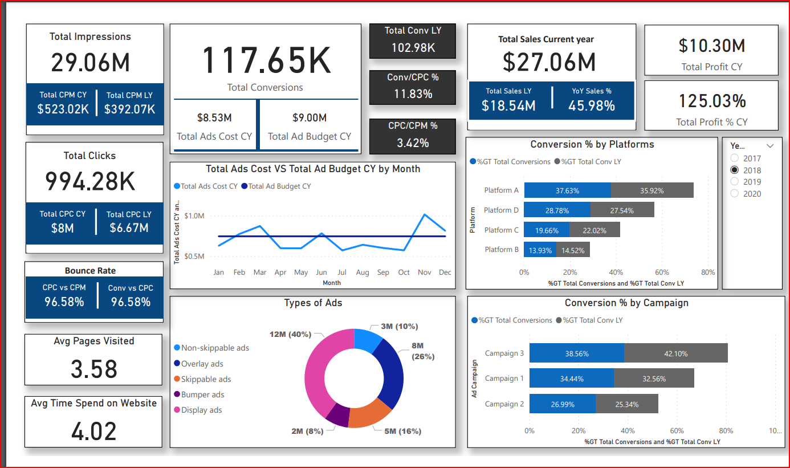
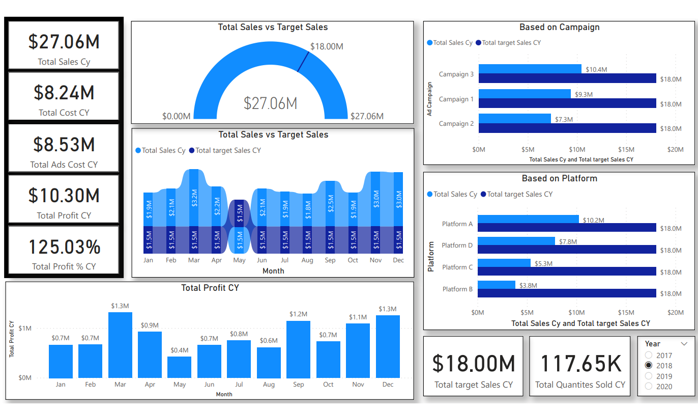

# Digital Marketing Analysis - Power BI Dashboard

## Overview

The primary objective of this Power BI dashboard is to optimize the performance of advertising campaigns across various platforms to achieve maximum return on investment (ROI) for clients. To accomplish this, we have access to multiple datasets containing features related to ad campaigns, impressions, clicks, conversions, sales, and advertising budgets.

## Dashboard Snapshots
Marketing Dashboard

Sales Dashboard

